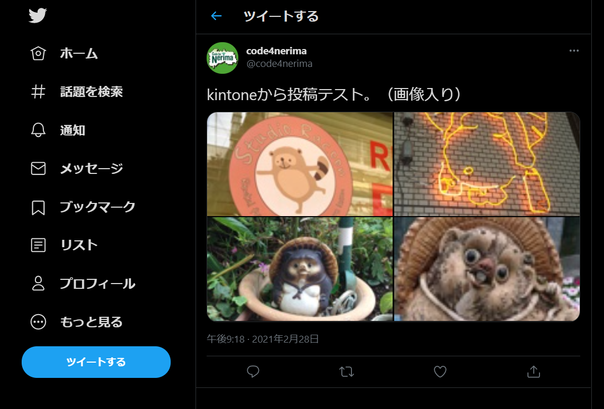

# 概要
KintoneからTwitterへの投稿をするためのアプリです。

kintoneで承認すると、Webhookに登録したRESTful APIが呼び出され、
RESTful APIにてTwitterへの投稿と、投稿結果のKintoneへの通知が行われます。

# 操作
1. Kintoneで投稿内容を登録します。


2. 登録したレコードを承認します。


3. 承認した内容でTwitterへ投稿されます。


4. 正常に登録された場合、Kintoneに投稿結果が反映されます。


※Twitterへの投稿でエラーが発生した場合は、TwitterのAPIが返すエラーコードとメッセージをKintoneに反映します。


# 開発環境
## kintoneのアプリ作成
### スクリプトの実行
kintone_appフォルダのスクリプトを実行して、アプリの作成・フィールドの追加を行います。

#### Windowsの場合
Powershellで実行します。

1. `01_create_kintone_app.ps1` を開く
2. 以下の変数を指定

```
$sub_domain='xxxx';    # kintoneのサブドメイン
$user_account='xxxx';  # kintoneにログインするユーザアカウント
$password='xxxx';      # kintoneにログインするパスワード
$app_name='xxxx';      # 作成するアプリの名前
```
3. Powershellで実行。正常に終了すると、以下の表示になります。


4. kintoneのアプリ一覧で、作成されたアプリが表示されていることを確認します。


#### Mac/Linuxの場合
（未作成）

### APIトークンの発行
作成したKintoneのアプリ上で作業します。

1. アプリの管理＞アプリの一覧＞設定 を開く
1. 設定タブ＞カスタマイズ／サービス連携 ＞ APIトークン を開く
1. 「生成する」を押してトークンを生成。アクセス権は「レコード閲覧」・「レコード編集」チェックをON
1. 「保存」を押す


### Webhookの登録
作成したKintoneのアプリ上で作業します。

1. 作成したアプリを開く
1. カスタマイズ／サービス連携 ＞ Webhook を開く
1. `説明`に任意の値を入力。
1. `Webhook URL`に、RESTful APIをデプロイした先のURLを指定。 `https://(デプロイしたサーバ)/api/Tweet`
1. `通知を送信する条件` に`レコードの編集`のみチェックを入れる。
1. `このWebhookを有効にする`にチェックが入っていることを確認。
1. 「保存」を押す。


### アプリの公開
アプリを公開する。（よく忘れる）


## Twitterのキー発行
### 開発者ツールでのアプリ作成

1. 開発者ポータルのページを開く。 https://developer.twitter.com/en/portal/dashboard
1. アプリを作成する。
- App Permissionsは `Read and Write`
- API key & secret を控える
- Access token & secret を発行し、控える。

# RESTful APIのローカル動作環境
## 開発環境
- Visual Studio 2019
- .NET 5
- C# 9
- CoreTweet 1.0.0.483

## パラメータの指定
appsettings.jsonに以下を指定します。

```
  "KintoneSettings": {
    "ServiceUrl": "(kintoneのログイン画面URL。https://(sub-domain).cybozu.com/)",
    "AppId": "(アプリのID。アプリ管理のアプリ一覧から確認できます。)",
    "ApiToken": "(発行したAPIトークンを指定)"
  },
  "TwitterSettings": {
    "ApiKey": "(API keyを指定)",
    "ApiSecret": "(API secretを指定)",
    "AccessToken": "(Access tokenを指定)",
    "AccessTokenSecret": "(Access token secretを指定)"
  }

```

# デプロイ環境
Microsoft AzureのApp Serviceへデプロイしています。
terraform参照。.NET 5なので、Windows/Linuxを問いません。
